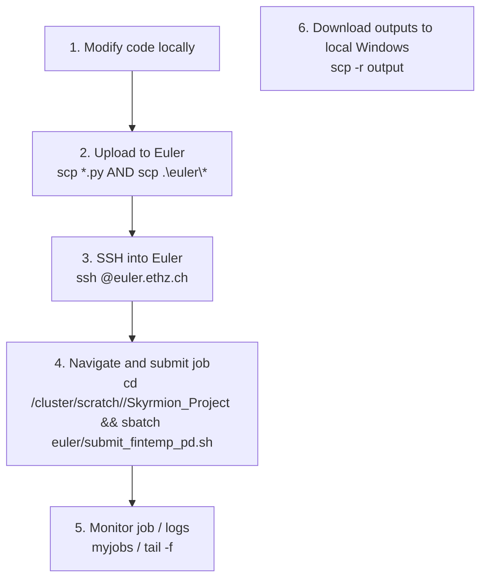

# Euler Simulation Workflow Cheat Sheet

This guide documents the full workflow for running JAX/Diffrax simulations on the ETH Zurich Euler HPC cluster from your local Windows environment.

---

## 1. Connecting to Euler

Open your local terminal (e.g., PowerShell on Windows) and log in using SSH:

```powershell
ssh <your_username>@euler.ethz.ch
```

> [!NOTE]
> Ensure you are connected to the ETH VPN if you are outside the ETH network.

---

## 2. Uploading Files to Euler (From Windows PowerShell)

Because modern Windows `scp` uses the SFTP protocol under the hood, it **does not expand remote environment variables like `$SCRATCH`**. Always use the absolute path `/cluster/scratch/<your_username>/` as shown below.

### Command A: Upload / Update the `euler` Configuration Folder
To copy or update the submission scripts and euler-specific runner scripts:
```powershell
scp .\euler\* <your_username>@euler.ethz.ch:/cluster/scratch/<your_username>/Skyrmion_Project/euler/
```

### Command B: Upload / Update all Python files in the Root Directory
To update all solver and analysis code files in one command:
```powershell
scp *.py <your_username>@euler.ethz.ch:/cluster/scratch/<your_username>/Skyrmion_Project/
```

### Command C: Full Project Upload (Clean & Zip - Recommended for large changes)
To transfer the whole workspace while skipping heavy files like `.git/`, `venv/`, or local `output/`:

1. **In local Windows PowerShell:**
   ```powershell
   # 1. Archive the project locally
   tar --exclude=".git" --exclude="__pycache__" --exclude="output" --exclude="venv" -czf project.tar.gz .

   # 2. Upload the archive
   scp project.tar.gz <your_username>@euler.ethz.ch:/cluster/scratch/<your_username>/
   ```

2. **Inside Euler SSH session:**
   ```bash
   # 3. Extract to scratch directory
   mkdir -p /cluster/scratch/<your_username>/Skyrmion_Project
   tar -xzf /cluster/scratch/<your_username>/project.tar.gz -C /cluster/scratch/<your_username>/Skyrmion_Project/

   # 4. Delete the archive
   rm /cluster/scratch/<your_username>/project.tar.gz
   ```

---

## 3. Submitting Jobs on Euler

> [!WARNING]
> **Do not run `sbatch` in your local Windows PowerShell!** It is a Linux utility that only exists on Euler. You must SSH into Euler first.

Once logged into Euler (`ssh <your_username>@euler.ethz.ch`), run:

1. **Navigate to the Scratch directory**:
   ```bash
   cd /cluster/scratch/<your_username>/Skyrmion_Project
   ```

2. **Submit the SLURM batch job**:
   ```bash
   sbatch euler/submit_fintemp_pd.sh
   ```

---

## 4. Monitoring Jobs & Looking at Output

Run these commands **inside your Euler SSH session**:

### Check Queue Status
* **Euler-specific wrapper** (highly recommended, beautifully formatted):
  ```bash
  myjobs
  ```
* **Standard SLURM command**:
  ```bash
  squeue -u <your_username>
  ```

### Cancel a Running Job
```bash
scancel <job_id>
```

### Stream standard output in Real-Time
```bash
tail -f fintemp_<job_id>.out
```

---

## 5. Looking at Files on Euler (Inside SSH Session)

To inspect, list, or review files directly inside Euler:

* **List files with write/modification dates:**
  * Show dates, sizes, and permissions:
    ```bash
    ls -l
    ```
  * Sort by date (newest first):
    ```bash
    ls -lt
    ```
  * Sort by date in reverse (newest at the bottom, easy to see at a glance):
    ```bash
    ls -ltr
    ```
  * Show dates with human-readable file sizes (e.g., 36K, 12M):
    ```bash
    ls -lh
    ```

* **Get exact timestamps (down to the second) for a specific file:**
  ```bash
  stat fintemp_LLG.py
  ```

* **Scrollable viewer (Best for code and large files):**
  ```bash
  less fintemp_LLG.py
  ```
  *(Press `q` to quit, or `/word` to search).*

* **Print file contents to terminal:**
  ```bash
  cat euler/submit_fintemp_pd.sh
  ```

* **Quick Terminal Editor (to view & make quick changes):**
  ```bash
  nano euler/submit_fintemp_pd.sh
  ```
  *(Press `Ctrl + X` to exit).*

---

## 6. Downloading Simulation Outputs

Run these commands from your **local Windows PowerShell** (root of your local `Skyrmion_Project` directory):

### Method A: Download the entire output folder
```powershell
scp -r <your_username>@euler.ethz.ch:/cluster/scratch/<your_username>/Skyrmion_Project/output/ ./
```

### Method B: Download a specific phase diagram dataset
```powershell
scp <your_username>@euler.ethz.ch:/cluster/scratch/<your_username>/Skyrmion_Project/output/phase_diagrams/fintemp/fintemp_pd_T0.01_L32_858.npz ./output/phase_diagrams/fintemp/
```

> [!TIP]
> **For older simulation runs on Euler (prior to folder reorganization):**
> If you are downloading historical runs that were executed before uploading the new python scripts to Euler, the files on the Euler cluster are still located in the old remote path. You can download them to your new local structure with:
> ```powershell
> scp <your_username>@euler.ethz.ch:/cluster/scratch/<your_username>/Skyrmion_Project/output/Fintemp/Phase\` Diagram\` Data/fintemp_pd_T0.01_L32_858.npz ./output/phase_diagrams/fintemp/
> ```

---

## Quick Reference Workflow Loop


